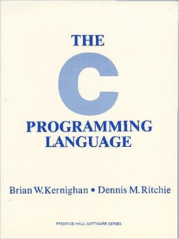

# The C Programming Language Exercises

Welcome to my personal repository for solving exercises from "The C Programming Language" by Brian Kernighan and Dennis Ritchie. The main goal of this repository is to challenge myself to solve each exercise in the book on my own. By doing so, I aim to improve my understanding of C programming concepts, syntax, and problem-solving skills.

## About the Book

"The C Programming Language" is a seminal book in the field of programming. Authored by the creators of the C language itself, Brian Kernighan and Dennis Ritchie, the book serves as a comprehensive guide to learning C programming from the ground up. Through a series of exercises, the book covers a wide range of topics, from basic concepts to more advanced programming techniques.

## Repository Structure

The repository is organized by chapters, with each chapter representing a different section of the book. Within each chapter, you will find the exercises listed, along with my own solutions. The solutions are crafted with the aim of not only achieving correct outputs but also exploring different approaches and best practices.

## Contributions

As the primary goal of this repository is personal growth and learning, I'll be attempting to solve all the exercises by myself. Therefore, contributions in the form of solutions are not sought. However, if you have insights, suggestions, or alternative methods that could enhance my understanding, feel free to share them in the issue discussions.

## Progress Tracking

I'll be updating this README as I make progress through the exercises. If you're also working through "The C Programming Language" and would like to compare solutions or share your experiences, don't hesitate to reach out.

## Disclaimer

Please note that the solutions in this repository are my own attempts and might not be the most optimal or efficient. Learning from mistakes and iteratively improving my solutions is an essential part of this journey.

Happy coding!

